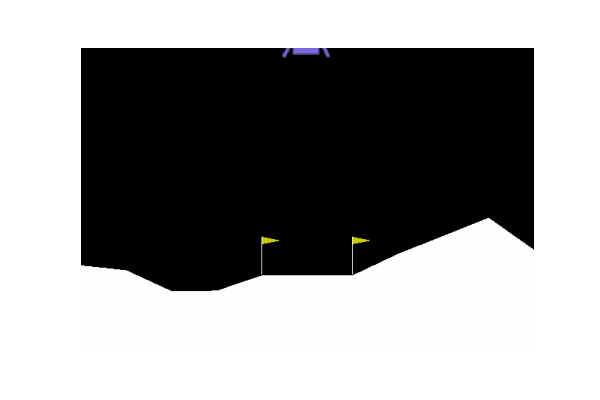

# Project 2 - Implementing Deep Q-Network on Lunar Landerv2

This paper describes Deep Q-Network (DQN) implementation to solve OpenAI's Lunar Lander-v2 environment by attempting to replicate the DQN Algorithm proposed by Mnih et al. The fundamental idea behind DQN is that the Q-Learning is now backed by a Stochastic Gradient Descent Neural Network to predict Q-values. The paper also discusses the fundamentals of Q-Learning, Function Approximation and Artificial Neural-Nets (ANN) that are quintessential in implementation of DQN algorithm. Finally, I discuss the results and influences of key hyperparamenters on the agent's learning performance.

## Code Execution

The src folder contains individual .ipynb files of all the 20 Experiments presented in the attached report. These files have to executed indiviually.

Running the Experiments:
1) Open .ipynb files starting with DQN
2) Change the path of self.model_filename and self.csv_filename (do not change the filename, just change the path to desired location)
3) Run all the cells.
4) Once the runtime converges (or terminates at 2000 episodes), a .h5 file and a .csv file is created.
5) Repeat this for all 20 experiments

Running the results:
1) Open .ipynb file Consolidated_Results
2) Makes sure the name of csv and h5 files are same as that of the names in the Consolidated_Results.ipynb. This is must.
3) Run all cells.
4) The file will first generate plots of 2000 training episodes of each experiment (based on csv files)
5) The file will run 500 episodes of "test" on all h5 models and plot results. (This could take time)
6) Open Combined_Plots.ipynb
7) Run all cells to generate all the combined plots presented in the report.
